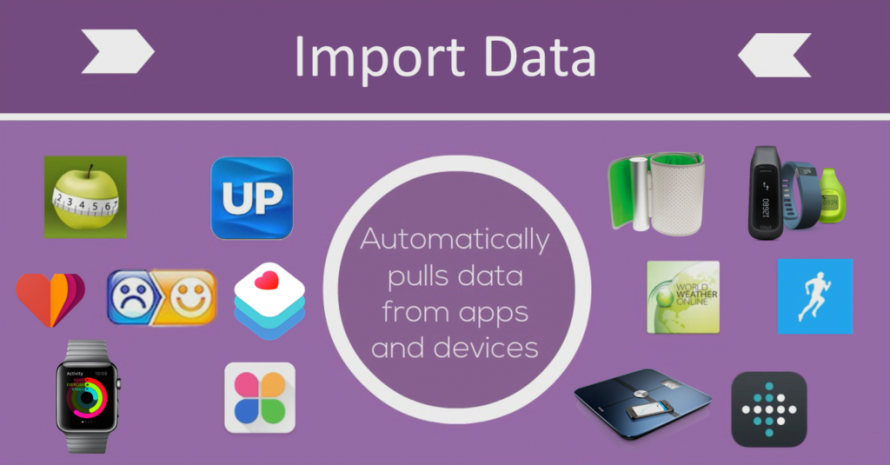
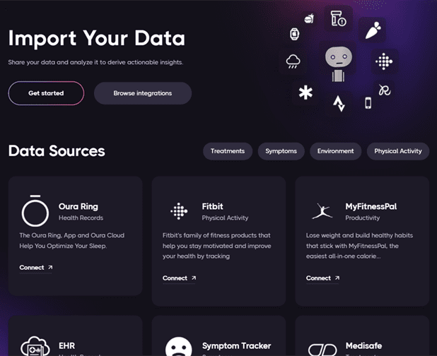

# 🕸 Data Import

The Connector Framework imports and normalizes data on all quantifiable aspects of human existence (sleep, mood, medication, diet, exercise, etc.) from dozens of applications and devices including:

- [Rescuetime](https://github.com/FDA-AI/FDAi/tree/develop/apps/dfda-1/app/DataSources/Connectors/RescueTimeConnector.php) – Productivity and Time Tracking
- [WhatPulse](https://github.com/FDA-AI/FDAi/tree/develop/apps/dfda-1/app/DataSources/Connectors/WhatPulseConnector.php) – Keystroke and Mouse Behaviour
- [Oura](https://github.com/FDA-AI/FDAi/tree/develop/apps/dfda-1/app/DataSources/Connectors/OuraConnector.php) – Sleep Duration, Sleep Quality, Steps, Physical Activity
- [Pollution](https://github.com/FDA-AI/FDAi/tree/develop/apps/dfda-1/app/DataSources/Connectors/WeatherConnector.php) – Air Quality, Noise Level, Particulate Matter
- [Netatmo](https://github.com/FDA-AI/FDAi/tree/develop/apps/dfda-1/app/DataSources/Connectors/NetatmoConnector.php) – Ambient Temperature, Humidity, Air Quality
- [Fitbit](https://github.com/FDA-AI/FDAi/tree/develop/apps/dfda-1/app/DataSources/Connectors/FitbitConnector.php) – Sleep Duration, Sleep Quality, Steps, Physical Activity
- [Withings](https://github.com/FDA-AI/FDAi/tree/develop/apps/dfda-1/app/DataSources/Connectors/WithingsConnector.php) – Blood Pressure, Weight, Environmental CO2 Levels, Ambient Temperature
- [Weather](https://github.com/FDA-AI/FDAi/tree/develop/apps/dfda-1/app/DataSources/Connectors/WeatherConnector.php) – Local Humidity, Cloud Cover, Temperature
- [Facebook](https://github.com/FDA-AI/FDAi/tree/develop/apps/dfda-1/app/DataSources/Connectors/FacebookConnector.php) – Social Interaction, Likes
- [GitHub](https://github.com/FDA-AI/FDAi/tree/develop/apps/dfda-1/app/DataSources/Connectors/GithubConnector.php) – Productivity and Code Commits
- [MyFitnessPal](https://github.com/FDA-AI/FDAi/tree/develop/apps/dfda-1/app/DataSources/Connectors/MyFitnessPalConnector.php) – Food and Nutrient Intake
- [MoodPanda](https://github.com/FDA-AI/FDAi/tree/develop/apps/dfda-1/app/DataSources/Connectors/MoodPandaConnector.php) – Basic Reported Mood
- [MoodScope](https://github.com/FDA-AI/FDAi/tree/develop/apps/dfda-1/app/DataSources/Connectors/MoodscopeConnector.php) – Detailed Reported Mood
- [Sleep as Android](https://github.com/FDA-AI/FDAi/tree/develop/apps/dfda-1/app/DataSources/Connectors/SleepAsAndroidConnector.php) – Snoring, Deep Sleep, Reported Sleep Rating
- [RunKeeper](https://github.com/FDA-AI/FDAi/tree/develop/apps/dfda-1/app/DataSources/Connectors/RunKeeperConnector.php) – Physical Activity
- [MyNetDiary](https://github.com/FDA-AI/FDAi/tree/develop/apps/dfda-1/app/DataSources/Connectors/MyNetDiaryConnector.php) – Food and Nutrient Intake, Vital Signs

## Related Code
- [Connectors](https://github.com/FDA-AI/FDAi/tree/develop/apps/dfda-1/app/DataSources/Connectors)
